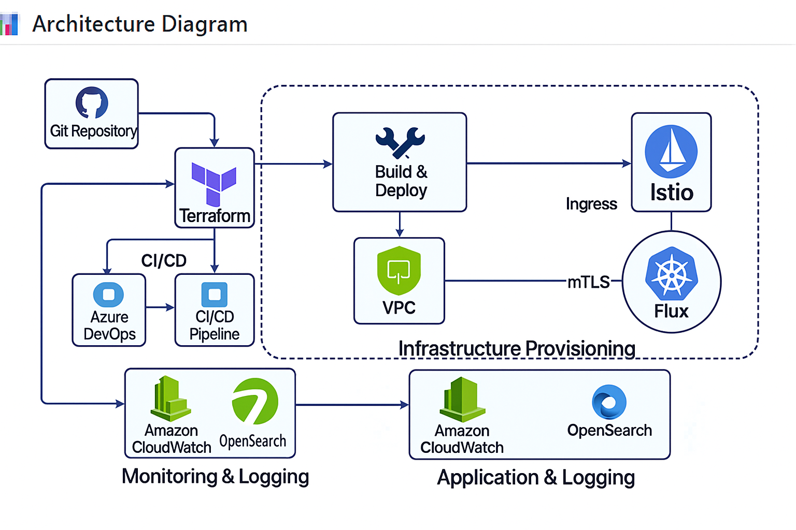

# AWS Cloud Project

This is a full-stack cloud infrastructure deployment project deployed on AWS Cloud.

## ✅ Project Features

- 🚀 Infrastructure-as-Code with Terraform
- 📦 Dockerized Node.js app deployed to AWS ECS (Fargate)
- ☁️ AWS resources: VPC, ECS, ECR, CloudWatch, OpenSearch
- 🔁 CI/CD with Azure DevOps Pipelines
- 📈 Logging via CloudWatch and OpenSearch

## 🧱 Project Structure

```
aws-cloud-project/
├── app/                  # Node.js application
│   ├── index.js
│   └── Dockerfile
├── terraform/            # Infrastructure definition
│   ├── main.tf
│   ├── variables.tf
│   └── outputs.tf
├── azure-pipelines.yml   # CI/CD pipeline definition
├── .gitignore
└── README.md
```

## 🛠 Deployment Process

1. **Infrastructure Provisioning (Terraform)**:
   - VPC, ECS Cluster, ECR, IAM Roles
   - CloudWatch log group and OpenSearch domain

2. **CI/CD Pipeline (Azure DevOps)**:
   - `terraform apply` via pipeline
   - Docker build and push to ECR
   - ECS service automatically pulls and runs latest image

3. **Monitoring & Logging**:
   - Logs streamed to CloudWatch
   - OpenSearch cluster available for log querying/visualization

## 🔐 Secrets Configuration

In Azure DevOps, set the following secrets in your Variable Group:

- `AWS_ACCESS_KEY_ID`
- `AWS_SECRET_ACCESS_KEY`

## 📊 Architecture Diagram


